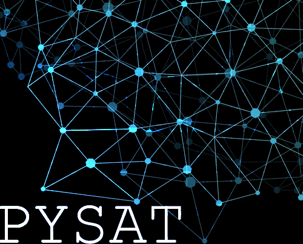

[](https://travis-ci.org/USGS-Astrogeology/PySAT_Point_Spectra_GUI) [](https://gitter.im/USGS-Astrogeology/PySAT?utm_source=badge&utm_medium=badge&utm_campaign=pr-badge&utm_content=badge)

# Easy Windows Installation

1. Download the [**setup**](https://github.com/tisaconundrum2/PySAT_Point_Spectra_GUI_Windows/archive/master.zip) file
2. Click and Install

# Installation with Miniconda

1. Make sure that you have [**miniconda**](http://conda.pydata.org/miniconda.html) installed

2. Open a terminal (on Windows, `cmd`, not Powershell) in the directory where you saved the file and type:

    ```bash
    conda install conda=3  # SKIP THIS LINE ON WINDOWS
    git clone --depth=50 --branch=master https://github.com/USGS-Astrogeology/PySAT_Point_Spectra_GUI.git
    git clone --depth=50 --branch=master https://github.com/USGS-Astrogeology/PySAT.git
    cd PySAT_Point_Spectra_GUI
    conda env create -n pointspectragui -f environment.yml
    source activate pointspectragui  # omit the `source` on Windows
    python PySAT/setup.py install
    python PySAT_Point_Spectra_GUI/point_spectra_gui
    ```

4. **Done**! Now, to use *PySAT Point Spectra GUI*, you have to first type `source activate PointSpectraGUI` in a terminal (omit the `source` on Windows), and then call `python PySAT_Point_Spectra_GUI/point_spectra_gui`.


# PYSAT UI
  

- The UI's backend is designed and created in Python with the QT framework
- The UI is being built to work closely with the original libraries

Current Road Ahead
- [x] Ported to version 5 of PyQt
- [x] Working Modules on UI
- [x] Selecting functions from Menubar adds functions dynamically
- [x] Shortcuts such as Ctrl S to save
- [ ] Embedded Plots and Graphs from data collected
- [x] ~~Package all python packages: sklearn, scipy, numpy, matplotlib, pysat for user consumption~~ It has been discovered that the user can download Anaconda, and run our files as normal.
- [x] Add ability to delete modules
- [x] Add ability to save plots in personal files
- [x] Add ability to save state of GUI, i.e. all number that user inputs will be there again after closing GUI
- [x] Add ability to save data frame at any point in the workflow 
- [ ] Setup a way to select points on a scatter plot.

## Control Flow


- The user begins by starting PYSAT_MAIN.
- PYSAT_MAIN will begin by loading the splash screen and all necessary UI pieces
- PYSAT_MAIN will then forward control to PYSAT_UI
- PYSAT_UI displays the mainframe in which the UI's submodules will be loaded into
- PYSAT_UI will then foward control to each submodule of focus
- Each submodule builds the collective UI library
- Each submodule fowards control to PYAT_FUNC which holds all the necessary logic functions
- These logic functions then forward commands to the various PYSAT and Anaconda libraries
- The values are then returned back up to PYSAT_FUNC which will then deal with changed data
